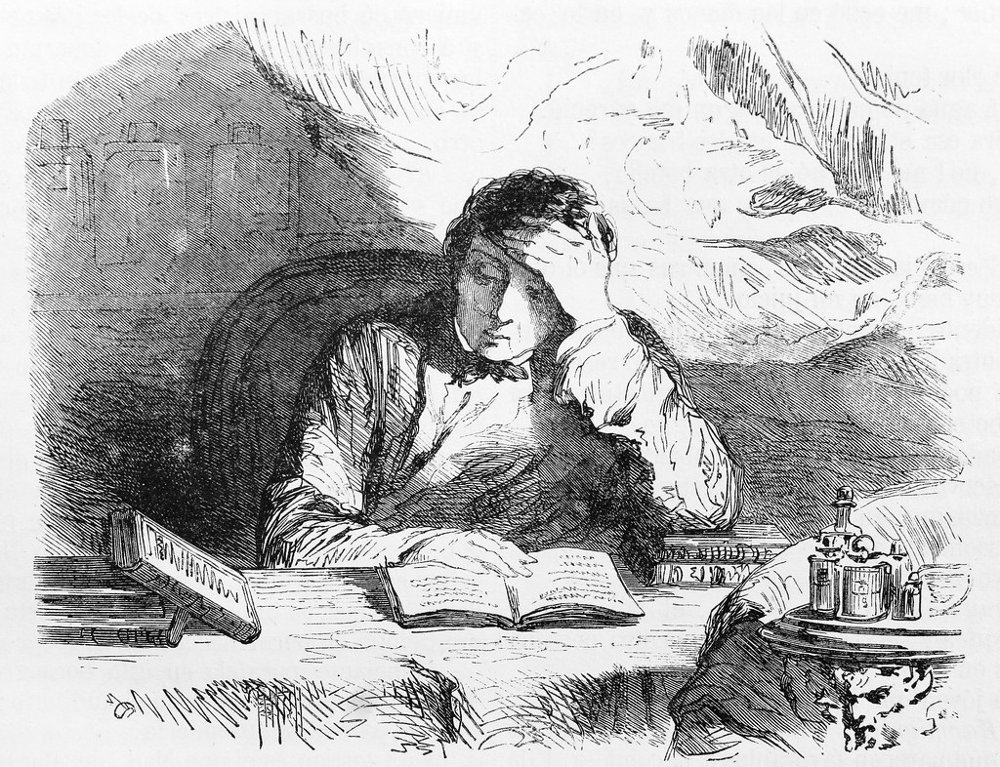

# auditor-application 🕵
🕵 Auditor for Application 🕵

This auditor determines if an application, package, and/or container image is installed.

It also informs on if the application, package, and/or container image exist on a container hub or package manager
server even if it is not on the local machine.

## What are auditors?
It is a simple command line application. It could be made out of any programming language. What makes an auditor/plugin
is that it informs what it supports and supports a or multiple entities data structure. But the data can be passed via
a `--data|-d` parameter or via a pipe `|` (stdin).

> More information on auditors/plugins can be found in [`judge`](https://github.com/AmadlaOrg/judge) README and
> `./.docs/`.

## 🐰 Amadla
Auditors like this one don't require [Amadla 🐰](https://amadla.org/) to function, but it requires a specific data
structure. The data structures that it supports are found the [Entity Supported](#-entity-supported) list section. The
data in entities are stored in [YAML](https://yaml.org/) ([HERY](https://github.com/AmadlaOrg/hery)) format but need to
be pass in [JSON](https://www.json.org/) format.

Every auditor/plugin to [`judge`](https://github.com/AmadlaOrg/judge) require to inform what it supports. So when
executing this application with the param `amadla` it will output a [JSON](https://www.json.org/) with information on
the version of [`judge`](https://github.com/AmadlaOrg/judge) or any other tools it supports and entities it supports.

> Side note: If working in bash with JSON is required, the tool [jq](https://jqlang.github.io/jq/) might be of great
> help.

Example:
```bash
auditor-application amadla
```

Output:
```json
{
  "supported": {
    "judge": {
      "version": "^0"
    },
    "amadla": {
      "entities": [
        "github.com/AmadlaOrg/EntityApplication"
      ]
    }
  }
}
```

### 📦 Entity Supported
- [github.com/AmadlaOrg/EntityApplication](https://github.com/AmadlaOrg/EntityApplication)

## ©️ Copyright
- "<a rel="noopener noreferrer" href="https://www.flickr.com/photos/37667416@N04/6875042129">Envenenamiento de M. Gustavo Fougnies, por M. de Bocarmé. &#039;M. de Bocarmé.&#039;</a>" by <a rel="noopener noreferrer" href="https://www.flickr.com/photos/37667416@N04">Biblioteca Rector Machado y Nuñez</a> is marked with <a rel="noopener noreferrer" href="https://creativecommons.org/publicdomain/mark/1.0/?ref=openverse">Public Domain Mark 1.0 </a>.

## :scroll: License

The license for the code and documentation can be found in the [LICENSE](./LICENSE) file.

---

Made in Québec 🏴󠁣󠁡󠁱󠁣󠁿, Canada 🇨🇦!
